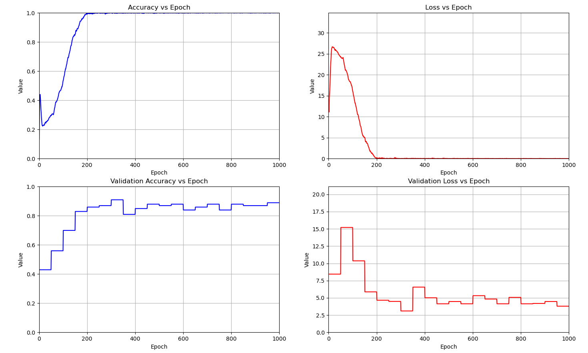
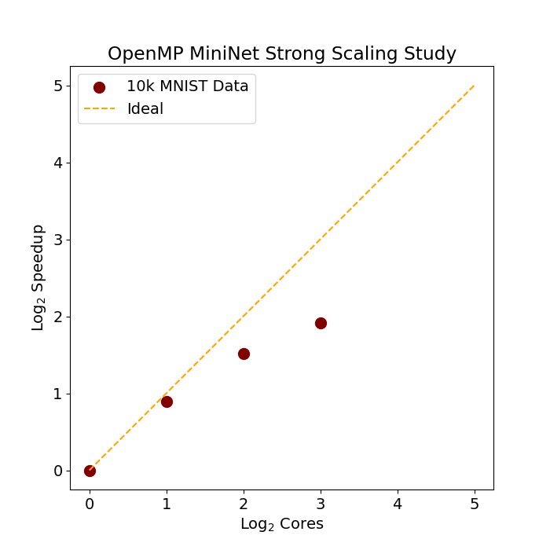
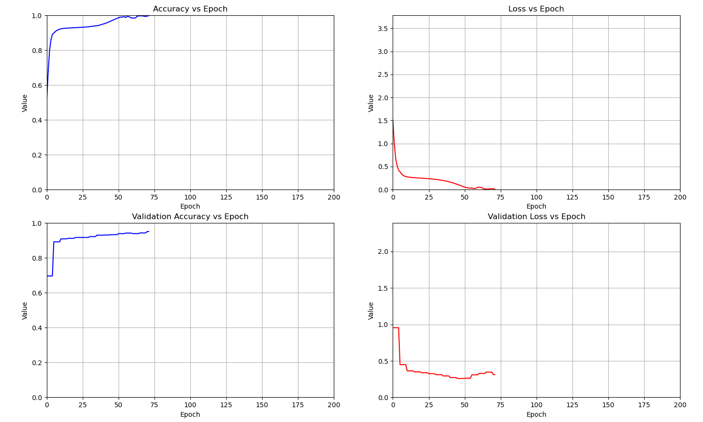
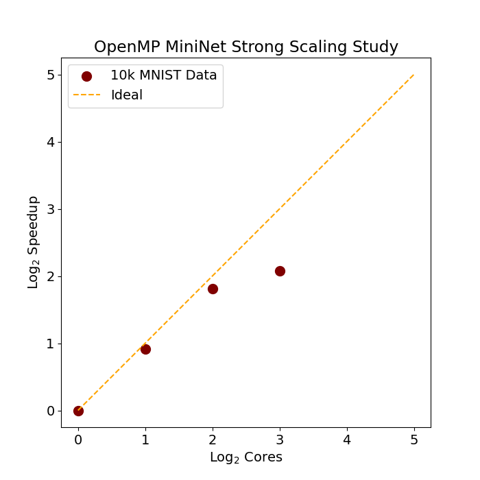

## Current Work  
- Starting Cuda Support
- Starting CNN Support
- Completing Mini Batch Support
- Completing Open MP support
- Developing Visualization matplotlib toolkit in python

## Planned Work
- Support for CNN and RNN layers
- CUDA implementation for computationally heavier training tasks

## Problems
- Too 'javanic', cool down on the oop format.
- Doesnt make best use of cpu buffer and cache
- Not as efficient as id like, *see strong scaling studies*

## Results
### Figure 1: Mnist Training Demonstration with 3 layers (Full Batch)
- Full batch training results in longer training times and greater number of epochs required to reach satisfactory validation accuracy.

### Figure 2: Mnist Strong Scaling Study (Full Batch)
- Underperforms on full batch training, parallelization not fully utilized. 

### Figure 3: Mnist Training Demonstration with 4 layers (Mini Batch)
- Performs noticeably faster than 3 layered full batch training, achieves target accuracy within 15 epochs. Full batch size of 10k, with mini batches of size 1k samples. 

### Figure 4: Mnist Strong Scaling Study (Mini Batch)
- Parallelization performs slightly better on mini batch training, the lack of performance on 8 cores might be due to
the limiting nature of omp not allowing me to fully utilize all 8 cores on my current machine.

