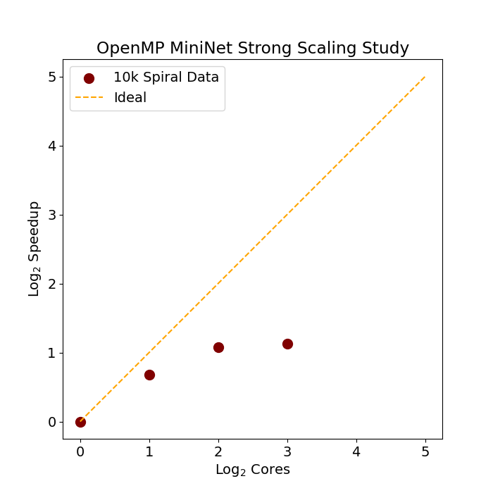

## Current Work  
- Open MP support
- Visualization matplotlib toolkit in python

### Figure 1: Mnist Training Demonstration with 2 layers

### Figure 2: Mnist Training Demonstration with 3 layers

### Figure 3: Spiral Strong Scaling Study

### Figure 4: Mnist Strong Scaling Study

## Planned Work
- Support for CNN and RNN layers
- CUDA implementation for computationally heavier training tasks

## Problems
- Too 'javanic', cool down on the oop format.
- Doesnt make best use of cpu buffer and cache
- Not as efficient as id like, *see strong scaling studies*, Note that the larger the matrix math requirments are the better the parallelization scales with cpu cores.
