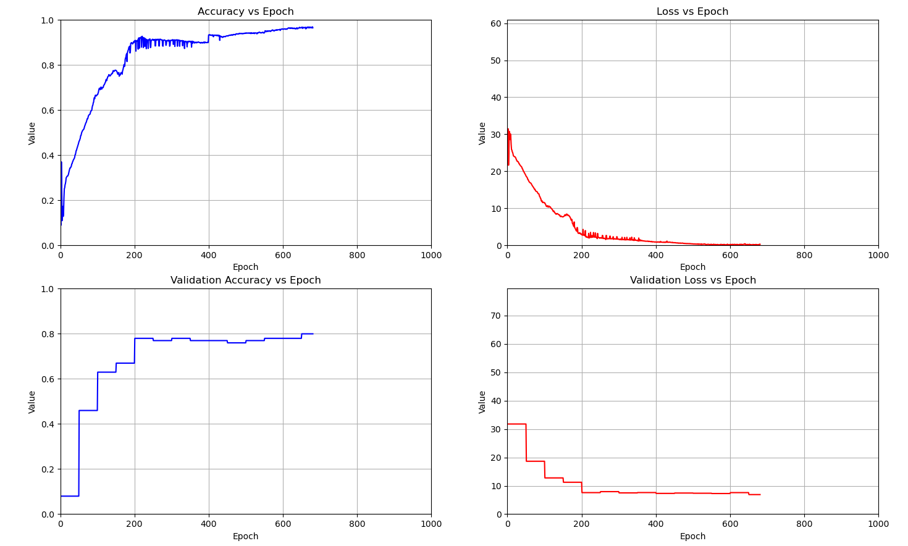

## Current Work  
- Open MP support
- Visualization matplotlib toolkit in python

## Planned Work
- Support for CNN and RNN layers
- CUDA implementation for computationally heavier training tasks

## Problems
- Too 'javanic', cool down on the oop format.
- Doesnt make best use of cpu buffer and cache
- Not as efficient as id like
